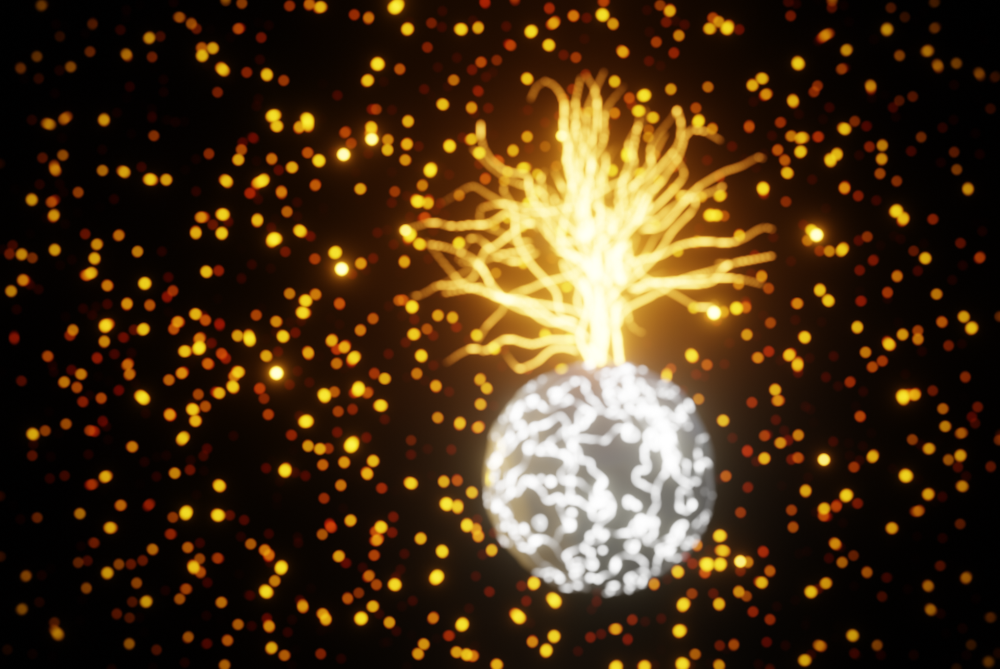

# Procedural Blender animation

Splines given by the user are used for guiding the growth over the object.

Geometry nodes at start.

Materials added manually.

# Results

Artstation: https://www.artstation.com/artwork/LedoYA

Video: https://vimeo.com/749724293

